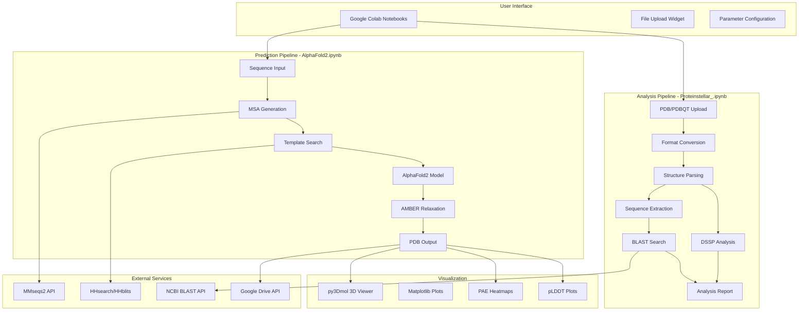
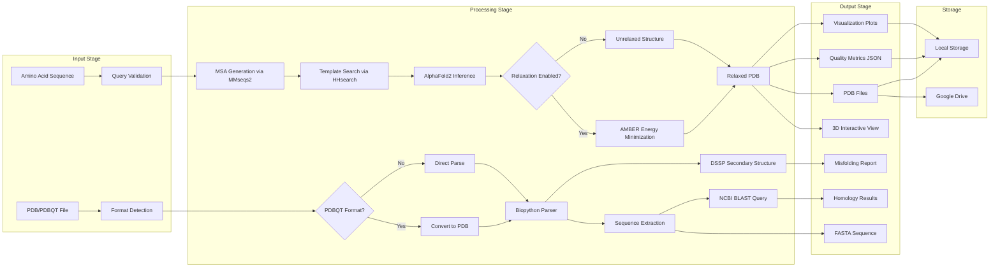
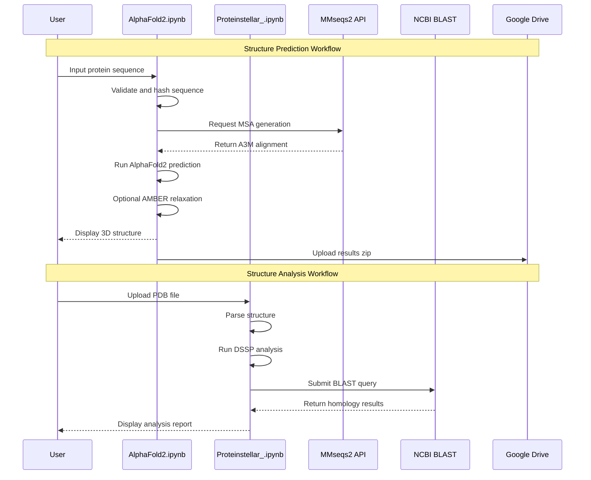
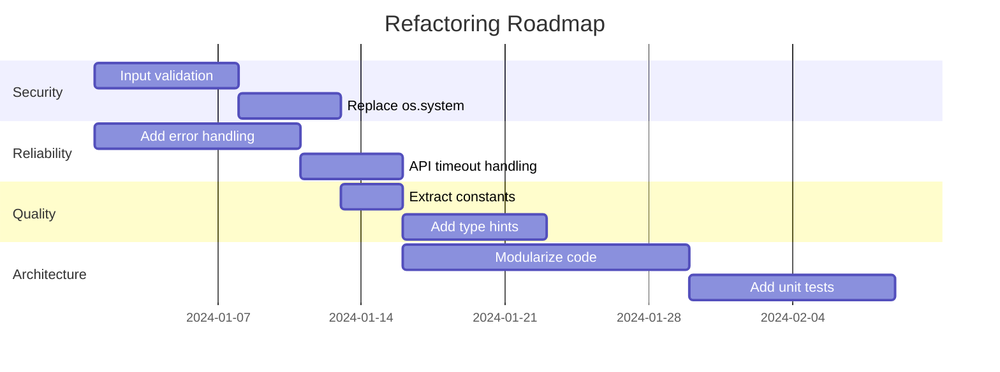

# Proteinstellar Project Architecture

## Executive Summary

The **Proteinstellar** project is a computational therapeutics platform designed for protein structure prediction, analysis, and validation. Built primarily as Google Colab notebooks, the system leverages state-of-the-art deep learning models (AlphaFold2) combined with traditional bioinformatics tools to enable researchers to:

1. **Predict protein structures** from amino acid sequences using ColabFold/AlphaFold2
2. **Analyze and validate** predicted structures for potential misfolding
3. **Identify homologous proteins** through BLAST searches
4. **Visualize results** through interactive 3D molecular viewers

The project targets cancer research applications, focusing on oncology-relevant proteins such as EGFR, HER2, VEGF, PD-1, p53, and BCL-2, with a specific case study on p53 and PRIMA-1 interactions.

---

## System Architecture Diagram



---

## Data Flow Diagram



---

## Component Interaction Map



---

## Technology Stack Summary

### Core Technologies

| Category | Technology | Version | Purpose |
|----------|------------|---------|---------|
| **Deep Learning** | AlphaFold2 | v2.x | Protein structure prediction |
| **ML Framework** | JAX | - | High-performance ML computations |
| **Neural Networks** | dm-haiku | 0.0.10 | Neural network library for JAX |

### Bioinformatics Tools

| Tool | Purpose |
|------|---------|
| **MMseqs2** | Fast sequence alignment and MSA generation |
| **HHsearch/HHblits** | Hidden Markov Model-based homology detection |
| **DSSP** | Secondary structure assignment |
| **Biopython** | Protein structure parsing and manipulation |
| **OpenMM** | Molecular dynamics simulations |
| **pdbfixer** | PDB file repair and preparation |
| **AMBER** | Force field for structure relaxation |

### Visualization Libraries

| Library | Purpose |
|---------|---------|
| **py3Dmol** | Interactive 3D molecular visualization |
| **matplotlib** | Static plots and charts |
| **IPython.display** | HTML rendering in notebooks |

### Data Processing

| Library | Purpose |
|---------|---------|
| **NumPy** | Numerical computations |
| **Biopython** | Sequence and structure I/O |
| **fileinput** | File manipulation |

### Platform & Integration

| Service | Purpose |
|---------|---------|
| **Google Colab** | Notebook execution environment |
| **Google Drive API** | Result storage and sharing |
| **pydrive2** | Google Drive Python interface |
| **ipywidgets** | Interactive UI components |

### External APIs

| API | Endpoint | Purpose |
|-----|----------|---------|
| **MMseqs2 API** | ColabFold server | MSA generation |
| **NCBI BLAST** | blastp against nr | Homology search |
| **3Dmol.js CDN** | 3dmol.org | Molecular visualization |

---

## Code Quality Assessment

### Severity Levels
- 🔴 **Critical**: Security vulnerabilities or major bugs
- 🟠 **High**: Significant issues affecting reliability
- 🟡 **Medium**: Code quality issues
- 🟢 **Low**: Minor improvements

### AlphaFold2.ipynb Issues

| Issue | Severity | Location | Description |
|-------|----------|----------|-------------|
| Shell command injection risk | 🔴 Critical | Lines 171-232 | `os.system()` calls with string concatenation |
| Magic numbers | 🟡 Medium | Line 42 | Hardcoded hash length `[:5]` without explanation |
| Redundant imports | 🟢 Low | Lines 22-28, 157, 418 | `os` imported multiple times |
| Missing error handling | 🟠 High | Lines 518-582 | `run()` function lacks try-catch |
| No input validation | 🟠 High | Line 46 | Query sequence not validated |
| Hardcoded paths | 🟡 Medium | Lines 179-181 | Python version-specific paths |
| Global state mutation | 🟡 Medium | Lines 64, 122-144 | Variables modified in global scope |

### Proteinstellar_.ipynb Issues

| Issue | Severity | Location | Description |
|-------|----------|----------|-------------|
| Duplicate installations | 🟢 Low | Lines 1, 87 | `pip install biopython` appears twice |
| Blocking BLAST calls | 🟠 High | Line 283 | No timeout for NCBI API calls |
| Incomplete Ramachandran validation | 🟡 Medium | Lines 260-261 | Angle check always passes valid angles |
| Hardcoded thresholds | 🟡 Medium | Line 271 | Magic number `0.1` for misfold ratio |
| No input validation | 🟠 High | Lines 133-141 | File content not validated |
| Missing type hints | 🟢 Low | All functions | No type annotations |
| Error swallowing | 🟡 Medium | Lines 191-209 | Generic exception handling |

### Code Metrics Summary

| Metric | AlphaFold2.ipynb | Proteinstellar_.ipynb |
|--------|------------------|----------------------|
| Total Lines | ~632 | ~317 |
| Functions | 5 | 5 |
| External Dependencies | 15+ | 8 |
| API Integrations | 3 | 1 |
| Error Handlers | 2 | 3 |
| Documentation | Extensive | Minimal |

---

## Recommendations

### Priority 1: Security Improvements

1. **Replace `os.system()` with `subprocess.run()`**
   - Use parameterized commands to prevent injection
   - Add proper error handling and return code checking
   ```python
   # Instead of:
   os.system(f"pip install {package}")
   # Use:
   subprocess.run(["pip", "install", package], check=True)
   ```

2. **Add input validation**
   - Validate protein sequences against allowed amino acid characters
   - Sanitize file uploads before processing
   - Implement file size limits

### Priority 2: Reliability Improvements

3. **Add timeout handling for API calls**
   - Implement timeout for NCBI BLAST queries
   - Add retry logic with exponential backoff
   ```python
   from Bio.Blast import NCBIWWW
   result_handle = NCBIWWW.qblast("blastp", "nr", sequence, 
                                   expect=10.0, hitlist_size=50)
   ```

4. **Implement comprehensive error handling**
   - Wrap main prediction pipeline in try-catch
   - Provide meaningful error messages to users
   - Log errors for debugging

5. **Add progress indicators**
   - Show progress bars for long-running operations
   - Provide estimated time remaining

### Priority 3: Code Quality Improvements

6. **Extract configuration to constants**
   ```python
   # config.py
   HASH_LENGTH = 5
   MISFOLD_THRESHOLD = 0.1
   BLAST_TIMEOUT = 300
   MAX_SEQUENCE_LENGTH = 2500
   ```

7. **Add type hints and docstrings**
   ```python
   def add_hash(base_name: str, sequence: str) -> str:
       """Generate unique job identifier by appending sequence hash.
       
       Args:
           base_name: Base job name
           sequence: Protein sequence to hash
           
       Returns:
           Job name with appended 5-character hash
       """
       return f"{base_name}_{hashlib.sha1(sequence.encode()).hexdigest()[:HASH_LENGTH]}"
   ```

8. **Consolidate duplicate code**
   - Remove duplicate imports and installations
   - Create shared utility module

### Priority 4: Architecture Improvements

9. **Modularize notebooks into Python packages**
   ```
   proteinstellar/
   ├── __init__.py
   ├── prediction/
   │   ├── alphafold.py
   │   └── msa.py
   ├── analysis/
   │   ├── dssp.py
   │   └── blast.py
   ├── visualization/
   │   └── viewer.py
   └── utils/
       ├── config.py
       └── validation.py
   ```

10. **Implement proper logging**
    ```python
    import logging
    logging.basicConfig(level=logging.INFO)
    logger = logging.getLogger(__name__)
    ```

11. **Add unit tests**
    - Test sequence validation
    - Test file format conversion
    - Mock external API calls

### Priority 5: Documentation Improvements

12. **Create API documentation**
    - Document all public functions
    - Add usage examples
    - Include parameter descriptions

13. **Add inline comments for complex logic**
    - Explain AlphaFold2 configuration options
    - Document Ramachandran angle thresholds

---

## Maintainability Analysis

### Technical Debt Assessment

| Category | Score | Notes |
|----------|-------|-------|
| **Code Organization** | 4/10 | Monolithic notebooks, no modular structure |
| **Documentation** | 6/10 | Good user docs, lacking code docs |
| **Error Handling** | 3/10 | Minimal, generic exception handling |
| **Testing** | 1/10 | No automated tests |
| **Security** | 3/10 | Shell injection risks, no input validation |
| **Dependencies** | 5/10 | Many external deps, version pinning inconsistent |

### Maintainability Factors

#### Strengths
- ✅ Clear separation between prediction and analysis workflows
- ✅ Extensive user-facing documentation in AlphaFold2.ipynb
- ✅ Leverages well-established bioinformatics libraries
- ✅ Interactive visualization capabilities
- ✅ Google Colab integration simplifies deployment

#### Weaknesses
- ❌ No separation of concerns within notebooks
- ❌ Global state management makes testing difficult
- ❌ Hardcoded values scattered throughout code
- ❌ No configuration management system
- ❌ Missing error recovery mechanisms
- ❌ No logging infrastructure

### Dependency Risk Analysis

| Dependency | Risk Level | Mitigation |
|------------|------------|------------|
| ColabFold | Medium | Pin to specific version |
| MMseqs2 API | High | Implement fallback MSA method |
| NCBI BLAST | Medium | Add caching, timeout handling |
| Google Colab | High | Document local installation |
| py3Dmol CDN | Low | Bundle locally if needed |

### Recommended Refactoring Roadmap



---

## Appendix: File Structure

```
protein/
├── AlphaFold2.ipynb          # Structure prediction notebook
├── Proteinstellar_.ipynb     # Structure analysis notebook
├── movie6.mp4                # Visualization video
├── Protein Steller.docx.pdf  # Technical documentation
├── Proteinstellar-Computational-Therapeutics-*.pdf  # Presentation
└── PROJECT_ARCHITECTURE.md   # This document
```

---

## References

1. Jumper, J., et al. (2021). Highly accurate protein structure prediction with AlphaFold. Nature, 596(7873), 583-589.
2. Mirdita, M., et al. (2022). ColabFold: Making protein folding accessible to all. Nature Methods, 19(6), 679-682.
3. Steinegger, M., & Söding, J. (2017). MMseqs2 enables sensitive protein sequence searching for the analysis of massive data sets. Nature Biotechnology, 35(11), 1026-1028.

---

*Document generated: December 2024*
*Version: 1.0*