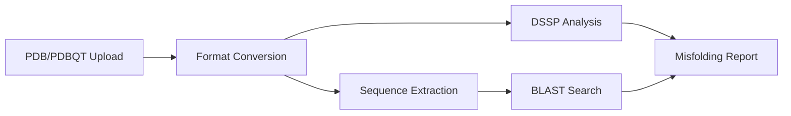

# Proteinstellar 🧬

[](https://opensource.org/licenses/MIT)
[](https://www.python.org/downloads/)
[](https://jupyter.org/)
[](https://github.com/deepmind/alphafold)

## Computational Therapeutics through AlphaFold-Based Structural Insights and Docking

**Proteinstellar** is a computational therapeutics platform designed for protein structure prediction, analysis, and validation. Built primarily as Google Colab notebooks, the system leverages state-of-the-art deep learning models (AlphaFold2) combined with traditional bioinformatics tools to enable researchers to predict protein structures, analyze and validate them for potential misfolding, identify homologous proteins, and visualize results interactively.

## 🎯 Key Features

- **Protein Structure Prediction**: Utilize AlphaFold2/ColabFold for high-accuracy structure prediction from amino acid sequences
- **Misfolding Detection**: Automated DSSP-based secondary structure analysis to identify potential misfolding
- **Homology Search**: Integrated NCBI BLAST search for identifying related proteins
- **Interactive 3D Visualization**: py3Dmol-powered molecular viewer for structure exploration
- **Quality Metrics**: Comprehensive pLDDT, PAE, and pTMscore analysis
- **Cancer Research Focus**: Targeted applications for oncology-relevant proteins (EGFR, HER2, VEGF, PD-1, p53, BCL-2)

## 🚀 Quick Start

### Prerequisites

- Google Colab account (recommended) or local Python 3.8+ environment
- GPU recommended for faster predictions (free on Google Colab)

### Running on Google Colab (Recommended)

1. **AlphaFold2 Structure Prediction**:
   - Open [AlphaFold2.ipynb](AlphaFold2.ipynb) in Google Colab
   - Paste your protein sequence in the input field
   - Click `Runtime` → `Run all`
   - Download results as zip file

2. **Structure Analysis**:
   - Open [Proteinstellar_.ipynb](Proteinstellar_.ipynb) in Google Colab
   - Upload your PDB/PDBQT file using the widget
   - Run all cells to perform DSSP analysis and BLAST search
   - Review misfolding detection and homology results

### Local Installation

```bash
# Clone the repository
git clone https://github.com/YOUR_USERNAME/proteinstellar.git
cd proteinstellar

# Install dependencies
pip install -r requirements.txt

# Launch Jupyter
jupyter notebook
```

## 📚 Documentation

- [PROJECT_ARCHITECTURE.md](PROJECT_ARCHITECTURE.md) - Detailed system architecture and technical documentation
- [Technical Documentation PDF](Protein%20Steller.docx.pdf) - Comprehensive project documentation
- [Presentation](Proteinstellar-Computational-Therapeutics-through-AlphaFold-Based-Structural-Insights-and-Docking-.pptx.pdf) - Project overview slides

## 🔬 Workflows

### Workflow 1: Structure Prediction Pipeline


### Workflow 2: Structure Analysis Pipeline



## 🧪 Use Cases

1. **Cancer Drug Discovery**: Analyze p53 and PRIMA-1 interactions for mutant p53 reactivation
2. **Protein Engineering**: Validate designed protein structures for stability
3. **Structural Bioinformatics**: Large-scale protein structure prediction and analysis
4. **Educational Research**: Learn protein folding principles with interactive tools

## 🛠️ Technology Stack

| Component | Technology |
|-----------|-----------|
| **Deep Learning** | AlphaFold2, JAX, dm-haiku |
| **Bioinformatics** | Biopython, MMseqs2, HHsearch, DSSP |
| **Visualization** | py3Dmol, matplotlib |
| **Platform** | Google Colab, Jupyter Notebook |
| **APIs** | NCBI BLAST, MMseqs2 API, Google Drive |

## 📊 Output Files

Each prediction run generates:
- **PDB structures** (relaxed and unrelaxed)
- **Quality metrics** (pLDDT, PAE, pTMscore in JSON format)
- **Visualization plots** (MSA coverage, confidence plots)
- **3D interactive views** (HTML/JavaScript)
- **Input MSA** (A3M format)
- **Analysis reports** (misfolding detection, BLAST results)
- **Citations** (BibTeX file)

## 🎓 Citations

If you use Proteinstellar in your research, please cite:

```bibtex
@software{proteinstellar2024,
  title={Proteinstellar: Computational Therapeutics through AlphaFold},
  year={2024},
  url={https://github.com/YOUR_USERNAME/proteinstellar}
}

@article{jumper2021alphafold,
  title={Highly accurate protein structure prediction with AlphaFold},
  author={Jumper, John and others},
  journal={Nature},
  volume={596},
  number={7873},
  pages={583--589},
  year={2021}
}

@article{mirdita2022colabfold,
  title={ColabFold: making protein folding accessible to all},
  author={Mirdita, Milot and others},
  journal={Nature methods},
  volume={19},
  number={6},
  pages={679--682},
  year={2022}
}
```

## 📋 System Requirements

### Minimum Requirements
- **RAM**: 8 GB
- **Storage**: 2 GB free space
- **Internet**: Required for API calls (MMseqs2, NCBI BLAST)

### Recommended Requirements (Local)
- **RAM**: 16 GB
- **GPU**: NVIDIA GPU with 8GB+ VRAM
- **Storage**: 10 GB (for model parameters)

### Google Colab (Free Tier)
- Automatically provisions GPU (T4)
- No local installation required
- ~12 hours runtime limit

## 🤝 Contributing

We welcome contributions! Please see our guidelines:

1. Fork the repository
2. Create a feature branch (`git checkout -b feature/amazing-feature`)
3. Commit your changes (`git commit -m 'Add amazing feature'`)
4. Push to the branch (`git push origin feature/amazing-feature`)
5. Open a Pull Request

## ⚠️ Known Limitations

- **API Rate Limits**: MMseqs2 API handles ~20-50k requests/day
- **Sequence Length**: Long sequences (>2500 residues) may fail on free Colab GPU
- **MSA Coverage**: MMseqs2 may find fewer hits than HHblits/HMMer against BFD
- **BLAST Timeout**: Large queries may timeout; consider using standalone BLAST+

## 🐛 Troubleshooting

**Issue**: "Runtime disconnected" on Colab
- **Solution**: Reconnect and run `Runtime` → `Factory reset runtime`

**Issue**: "Out of memory" error
- **Solution**: Reduce sequence length or use smaller `max_msa` parameter

**Issue**: BLAST query hangs
- **Solution**: Check internet connection; NCBI server may be overloaded

**Issue**: Download popup blocked
- **Solution**: Disable adblocker or manually download from Colab file browser

## 📞 Support

- **Issues**: [GitHub Issues](https://github.com/YOUR_USERNAME/proteinstellar/issues)
- **Discussions**: [GitHub Discussions](https://github.com/YOUR_USERNAME/proteinstellar/discussions)
- **Email**: your.email@example.com

## 📄 License

This project is licensed under the MIT License - see the [LICENSE](LICENSE) file for details.

**Note**: This software uses AlphaFold2 (Apache 2.0) and its parameters (CC BY 4.0). See [AlphaFold license](https://github.com/deepmind/alphafold) for details.

## 🙏 Acknowledgments

- **DeepMind** - AlphaFold2 model and source code
- **Söding Lab & KOBIC** - MMseqs2 server infrastructure
- **David Koes** - py3Dmol visualization library
- **ColabFold Team** - Simplified AlphaFold2 implementation

---

<p align="center">
  Made with ❤️ for the structural biology community
</p>
<p align="center">
  <a href="#top">⬆️ Back to Top</a>
</p>
